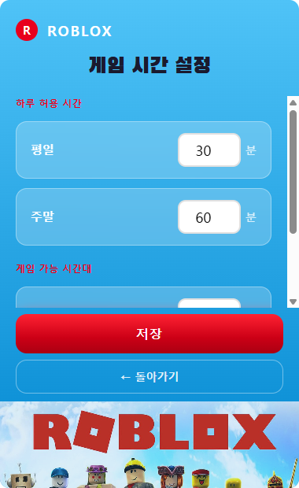
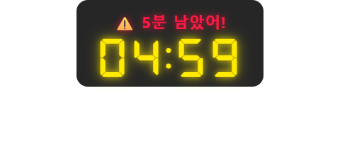
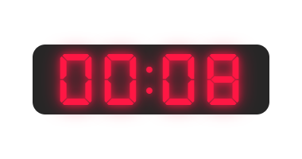

# 🎮 My Pact — 나와의 서약

> **자녀의 로블록스 게임 시간을 부모가 설정하고, 자녀 스스로 서약을 지키도록 돕는 Electron 데스크탑 타이머 앱**

[](#) [](#) [](#)

---

## 앱 이름: My Pact

> *"나 자신과의 서약, 내 미래를 위해"*

**Pact**는 단순한 약속(promise)이 아닙니다. 당사자 간의 구속력 있는 엄숙한 합의 — 쉽게 깰 수 없는 서약에 가까운 단어입니다.

이 앱의 이름은 "게임 시간을 지키겠다"는 가벼운 다짐이 아니라, **자기 자신에게 하는 진지한 서약**을 담고 있습니다.

부모가 강제로 끄는 것이 아니라, 타이머가 울리기 전에 스스로 마무리하는 선택 — 그 엄숙한 서약들이 쌓여 미래의 자신을 만든다는 의미입니다.

---

## 왜 만들었나

MS Family Safety 같은 기존 자녀 보호 앱은 오류가 잦고, 자녀와의 구두 협상은 매일 반복됩니다.  
이 앱은 그 문제를 **시스템으로 해결**합니다.

- ✅ 오류 없이 작동하는 커스텀 타이머
- ✅ 자녀가 멋대로 끌 수 없는 구조 (종료 버튼 없음, 트레이 잠금)
- ✅ 로블록스 실행 시 타이머 자동 시작 — 아이가 앱을 켜지 않아도 됨
- ✅ 시간이 되면 로블록스를 자동 강제 종료
- ✅ 실행 중에는 로블록스 종료/앱 숨김으로 타이머 회피 불가 — 재부팅 후 영구 복원은 관리자/SYSTEM 쓰기 권한 또는 Windows Service 필요
- ✅ 부모만 아는 PIN으로 타이머 조정/중지/설정 변경
- ✅ 표준 자녀 계정 기준 자동 재실행/종료 우회 완화 (완전 방지는 Windows Service 필요)
- ✅ 제어판에서 앱 삭제 불가 — 언인스톨 시 부모 PIN 검증

---

## 스크린샷

### 메인 화면 · 설정 화면

| 대기 화면 | 설정 화면 |
|:-:|:-:|
|  |  |

> 로블록스 테마 배경 · "나와의 서약" 타이틀 · 빨간 시작 버튼 | 평일/주말 허용 시간 · 시작·종료 시각 설정

### 🕹️ 타이머 오버레이 — 시간대별 색상

| 초록 (5분 초과) | 노랑 (5분 이하) |
|:-:|:-:|
|  |  |

| 주황 (3분 이하) | 빨강 (1분 이하) |
|:-:|:-:|
|  |  |

> 우측 상단 코너에 반투명 오버레이로 표시 · DSEG7 전자시계 폰트

### ⚠️ 경고 팝업 + 카운트다운

| 경고 메시지 (5분 전) | 최종 카운트다운 (10초) |
|:-:|:-:|
|  |  |

> 경고 시 타이머가 화면 중앙으로 이동해 메시지 표시 후 코너로 복귀 · 10초부터는 중앙 유지

---

## 주요 기능

### 🕹️ FPS 오버레이 스타일 타이머
게임 화면을 방해하지 않도록 우측 상단에 반투명으로 표시됩니다.  
DSEG7 전자시계 폰트 + 잔여 시간에 따른 색상 변화:

| 남은 시간 | 색상 |
|-----------|------|
| 5분 초과 | 🟢 초록 |
| 5분 이하 | 🟡 노랑 |
| 3분 이하 | 🟠 주황 |
| 1분 이하 | 🔴 빨강 |

### ⚠️ 단계별 경고 팝업
경고 시점이 되면 타이머가 우측 상단 → 화면 중앙으로 이동해 4초간 메시지를 표시한 뒤 원위치로 복귀합니다.

| 시점 | 동작 |
|------|------|
| 5분 전 | 중앙 이동 → `⚠️ 5분 남았어!` → 복귀 |
| 3분 전 | 중앙 이동 → `⚠️ 3분 남았어!` → 복귀 |
| 1분 전 | 중앙 이동 → `⚠️ 1분 남았어!` → 복귀 |
| 30초 전 | 중앙 이동 → `⏰ 30초 남았어!` → 복귀 |
| 10초 ~ 0초 | 중앙에서 카운트다운 유지 |
| 0초 | `🚫 게임 셧다운...` → 로블록스 강제 종료 |

### 🎮 로블록스 자동 감지 + 타이머 자동 시작
아이가 타이머 앱을 직접 실행하지 않아도, 로블록스를 켜는 순간 자동으로 타이머가 시작됩니다.

- 3초마다 `tasklist`로 `RobloxPlayer.exe`, `RobloxPlayerBeta.exe` 실행 여부 감지
- 허용 시간대 내에서 감지되면 자동 시작 + 화면에 배너 표시
- **허용 시간 외에 로블록스 실행 시 즉시 강제 종료** (타이머 시작 없이)
- 로블록스 종료 시 현재 세션 잔여 시간을 저장하고 타이머를 일시정지합니다. 재실행하면 남은 시간부터 이어집니다.

### 🔒 종료 방지 + 트레이 상시 유지
아이가 앱을 강제로 닫는 경로를 모두 차단합니다.

- X버튼 / Alt+F4 → 앱 종료 대신 트레이로 숨김
- 작업 표시줄 아이콘 없음 (`skipTaskbar: true`)
- 트레이 우클릭 메뉴에 종료 옵션 없음
- 트레이 단일 클릭 → 메인 창 표시

### 🛑 작업 관리자 종료 우회 완화
설치 시 HKLM Run과 Windows Scheduled Task를 함께 등록합니다.

- HKLM Run — 부모/자녀 계정 로그온 시 각자 세션에서 자동 실행
- `schtasks /rl HIGHEST` — 관리자 세션에서 높은 권한 자동 실행 보조
- 사용자 모드 Electron 앱이므로 관리자 권한 사용자는 작업 관리자에서 종료할 수 있습니다. 표준 자녀 계정 기준으로 자동 재실행/설정 보호를 강화하며, 더 강한 종료 방지는 별도 Windows Service가 필요합니다.
- 앱 제거 시 Scheduled Task 자동 삭제

### 🔐 앱 삭제 방지 (언인스톨러 PIN 잠금)
제어판 → 앱 추가/제거에서 삭제를 시도하면 부모 PIN을 먼저 요구합니다.

- 언인스톨러 시작 직전(`un.onInit`)에 PIN 입력 다이얼로그 표시
- 틀린 PIN 또는 취소 시 파일 삭제 없이 완전 차단
- 언인스톨러는 `%ProgramData%\MyPact\Admin\admin-secret.json`의 보호된 PIN 해시로 검증합니다.
- 초기 언인스톨 PIN: `0000`

### 🔄 재부팅 후 타이머 복원
부모/자녀 Windows 계정이 같은 `%ProgramData%\MyPact\Data` 상태를 공유해 재시작 후 남은 시간을 복원합니다.

- 타이머 시작 시 `%ProgramData%\MyPact\Data\timer-state.json`에 상태 저장을 시도
- 재시작 후 당일 유효한 타이머 상태가 있고 Roblox가 실행 중이면 남은 시간부터 자동 재개
- watchdog이 앱을 되살렸더라도 Roblox가 꺼져 있으면 타이머를 흐르게 하지 않고 남은 시간을 일시정지 상태로 보존
- 자정 이후(날짜 변경) 또는 관리자 설정에서 비활성화 시 무효화
- `Data\`는 표준 계정에서도 세션/잔여시간 기록을 남길 수 있도록 쓰기 가능해야 합니다. 이 파일까지 변조 방지하려면 Windows Service/SYSTEM 보조가 필요합니다.

### 🛡️ 관리자 PIN 패널 (트레이 3클릭)
부모만 접근할 수 있는 비밀 관리자 패널입니다.

**접근 방법**: 트레이 아이콘을 1.5초 이내에 **3번 클릭**

**기능**:
| 기능 | 설명 |
|------|------|
| 타이머 시간 조정 | 실행 중인 타이머에 +5분 단위 추가/차감, 직접 입력으로 원하는 분 조정 |
| 타이머 중지 | 관리자 권한으로 즉시 중지 |
| 재부팅 복원 토글 | 쓰기 권한이 있는 환경에서 재시작 후 타이머 유지 여부 ON/OFF |
| 비밀번호 변경 | 현재 비밀번호 확인 후 새 비밀번호로 변경 |

- 초기 비밀번호: `0000`
- 5회 오입력 시 30초 잠금
- 숫자 패드 클릭 + 물리 키보드(0–9 / Backspace / Enter) 모두 지원
- 실행 중 타이머는 `+5/+10/+15/+30/+60분`, `-5/-10/-15/-30/-60분`, 직접 입력(예: `25`, `-10`)으로 조정 가능

### ⚙️ 설정 화면
- 평일 / 주말 허용 시간: **`XX분 × X회`** 형식으로 세션당 시간과 하루 횟수를 별도 설정
- 우측에 합계 분 실시간 표시 (예: 60분 × 2회 = 합계 120분)
- 게임 시작 가능 시각 / 종료 시각 설정
- 설정 저장 (`%ProgramData%\MyPact\settings.json`)
- PIN 인증은 앱 UI에서 설정 변경을 제한합니다. 현재 표준계정 저장 요구 때문에 `%ProgramData%\MyPact` 쓰기 권한을 열어 두므로, 파일을 직접 수정하는 변조까지 완전히 막으려면 Windows Service/SYSTEM 보조 프로세스가 필요합니다.

### 📅 데일리 세션 쿼터 관리
하루 허용 세션이 소진되면 로블록스 재실행이 즉시 차단됩니다.

- 타이머가 **만료**될 때만 세션 1회 카운트 증가 (닫으면 일시정지 처리)
- 로블록스를 닫으면 잔여 시간 저장 → 재실행 시 이어서 재개
- 허용 횟수 모두 소진 후 로블록스 실행 시 즉시 강제종료
- 자정이 지나면 당일 기록 리셋, 새 날 자동 적용
- 메인 화면에 `X/X회 완료` 세션 진행 현황 표시

---

### ✅ v0.60.0 안정화 요약
최초 코드리뷰에서 지적했던 핵심 런타임 우회 경로와 이후 실기기 테스트에서 발견된 시작/트레이 문제를 정리한 안정화 릴리즈입니다.

- 기본 PIN `0000`의 기본 해시를 전체 SHA-256 값으로 고정하고 회귀 테스트를 추가했습니다.
- 앱 시작 시 Roblox가 이미 실행 중이어도 허용 시간/세션 쿼터/부모 승인 정책을 반드시 검사합니다.
- 타이머 실행 중에도 허용 시간 종료를 계속 검사해 종료 시각이 지나면 Roblox를 강제 종료합니다.
- Roblox 프로세스가 사라지면 타이머를 즉시 일시정지하고 남은 시간을 보존합니다.
- Roblox가 실행 중이 아닌 패키지 앱에서는 타이머 시작을 차단합니다.
- 부모 PIN 승인으로 차단된 Roblox 실행은 승인 성공 후 원래 실행 커맨드로 다시 시작합니다.
- 트레이 아이콘 로딩 실패 시 앱이 죽지 않도록 다중 icon 후보와 내장 fallback을 적용했습니다.
- `--start-hidden` 자동실행과 수동 실행을 구분해, 수동 실행 시에는 메인 창이 정상 표시되도록 수정했습니다.
- Windows installer GitHub Actions에서 테스트/typecheck/build와 실제 NSIS 설치본 artifact 생성을 검증합니다.

### 🧭 추가 개선 필요 사항
아래 항목은 현재 실사용을 막는 긴급 버그는 아니며, 아이가 고급 우회까지 시도하는 단계나 장기 유지보수 단계에서 처리할 후속 과제입니다.

1. **Data JSON 직접 변조 방지**
   - 현재 `%ProgramData%\MyPact\Data`는 부모/자녀 계정이 같은 타이머 상태를 공유하기 위해 표준 사용자 쓰기가 필요합니다.
   - `daily-usage.json`, `timer-state.json`, `sessions.json`의 값 검증은 하지만, 파일 삭제/직접 편집까지 완전히 막지는 않습니다.
   - 강한 방지가 필요해지면 Windows Service/SYSTEM 보조 프로세스가 실제 감시자 역할을 맡는 구조로 확장합니다.

2. **PIN 보안 하드닝**
   - 현재는 4자리 PIN + SHA-256 기반입니다.
   - 추후 6자리 이상 PIN, salt 포함 PBKDF2/bcrypt/argon2, 기본 PIN 강제 변경, 앱 재시작 후에도 유지되는 실패 횟수 제한을 적용합니다.

3. **시작/감시 로그 강화**
   - watchdog, 자동실행, Roblox 차단/재실행 이벤트를 `%ProgramData%\MyPact\Logs`에 남기면 다음 실기기 장애 분석 시간이 줄어듭니다.

4. **main process 구조 분리**
   - 현재 `main.ts`는 안정화 과정에서 책임이 많아졌습니다.
   - 기능 추가 전에 `robloxProcess.ts`, `timerEngine.ts`, `policyEngine.ts`, `tray.ts`, `watchdog.ts`로 점진 분리하면 테스트성과 유지보수성이 좋아집니다.

---

## 기술 스펙

| 항목 | 내용 |
|------|------|
| **런타임** | Electron 31 |
| **UI 프레임워크** | React 18 + TypeScript |
| **빌드 도구** | electron-vite |
| **스타일링** | Tailwind CSS |
| **폰트** | DSEG7 Classic (타이머), Black Han Sans (타이틀) |
| **패키지 매니저** | npm |
| **배포 타겟** | Windows 11 (NSIS 인스톨러) |
| **데이터 저장** | 공용 로컬 JSON 파일 (`%ProgramData%\MyPact\`, 런타임 상태는 `Data\`) |
| **프로세스 제어** | Node.js `child_process` (taskkill, schtasks) |
| **보안** | SHA-256 비밀번호 해싱, main-process 관리자 세션, NSIS 언인스톨러 PIN 잠금, HIGHEST Scheduled Task 보조 |

---

## 데이터 저장 위치

모든 데이터는 `%ProgramData%\MyPact\` 에 저장됩니다. 부모 관리자 계정과 자녀 표준 계정이 같은 설정과 상태를 공유합니다. PIN 검증자는 별도 `Admin\` 폴더에 저장하지만, 표준계정에서도 PIN 인증 후 설정/상태를 저장해야 하므로 현재 구조만으로 파일 직접 변조를 완전히 차단할 수는 없습니다. 설정과 런타임 상태까지 표준 사용자 직접 변조를 막으려면 Windows Service/SYSTEM 보조 프로세스가 필요합니다. 기존 `~/.mypact/` 데이터는 최초 실행 시 공용 저장소가 비어 있을 때 자동 복사됩니다.

```
%ProgramData%\MyPact\
├── settings.json       # 허용 시간, 시간대, 재부팅 복원 옵션
├── settings.json.bak   # 설정 저장 실패 대비 자동 백업
├── Admin\
│   └── admin-secret.json  # 관리자 PIN 검증자 (관리자/SYSTEM 쓰기, 표준 사용자 읽기)
└── Data\
    ├── sessions.json       # 게임 세션 기록 (부모/자녀 계정 공유 쓰기)
    ├── timer-state.json    # 재부팅 복원용 타이머 상태 (부모/자녀 계정 공유 쓰기)
    └── daily-usage.json    # 당일 세션 쿼터와 잔여 시간 (부모/자녀 계정 공유 쓰기)
```

관리자 PIN 원문은 레지스트리에 저장하지 않습니다. 언인스톨러도 보호된 `admin-secret.json`의 해시와 입력 PIN의 SHA-256 해시를 비교합니다.

---

## 프로젝트 구조

```
roblox-playtime-guardian/
├── CHANGELOG.md              # 버전별 변경 이력
├── README.md                 # 이 파일
├── DEVLOG.md                 # 개발 일지
├── AI_CASE_STUDY.md          # AI 활용 사례 게시글
├── PRD/                      # 기획 문서
├── build/
│   └── installer.nsh         # NSIS 커스텀 매크로 (Scheduled Task, PIN 잠금)
├── screenshots/              # README 스크린샷
├── resources/
│   ├── icon.ico              # Windows 앱 아이콘
│   ├── icon-256.png          # macOS 앱 아이콘
│   └── tray-icon.png         # 트레이 아이콘
└── src/
    ├── main/
    │   ├── main.ts           # 메인 프로세스 (트레이, 타이머, 창 관리)
    │   ├── ipc.ts            # IPC 핸들러 (설정, 세션, 관리자)
    │   └── fileStore.ts      # 로컬 JSON 파일 I/O
    ├── preload/
    │   └── index.ts          # Preload 스크립트
    └── renderer/src/
        ├── App.tsx           # 라우팅 (일반 / 관리자 창)
        ├── index.css         # 글로벌 스타일
        ├── env.d.ts          # window.api 타입 선언
        └── pages/
            ├── Timer.tsx      # 메인 타이머 + 오버레이
            ├── Settings.tsx   # 설정 화면
            └── AdminPanel.tsx # 관리자 PIN 패널
```

---

## 설치 및 실행

### 요구사항
- Node.js 18+

### 개발 모드 실행

```bash
npm install
npm run dev
```

### Windows 배포 빌드

> **빌드 전 반드시 확인 후 진행**  
> 기존 설치본 또는 이전 `dist\win-unpacked` 앱이 실행 중이면 `app.asar` 잠금으로 패키징 삭제 단계가 실패할 수 있습니다. 먼저 실행 중인 `My Pact` / 구버전 `My Pact for My Future` 프로세스를 종료하거나 제거하세요.

```bash
npm run package:win
```

빌드 결과물: `dist/` (`.exe` NSIS 인스톨러)

최종 검증 설치본:

```text
GitHub Release `v0.60.0`: https://github.com/toughCSB/roblox-playtime-guardian/releases/tag/v0.60.0
My Pact Setup 0.60.0.exe
SHA256: 1b63fc6cd165689fae668c27edcc41adcbea77071f63645d838a603561c739f9
```

Windows 11 Smart App Control에서 차단되지 않는 정식 배포본은 신뢰된 코드 서명 인증서로 서명해야 합니다. 인증서 환경변수(`CSC_LINK`, `CSC_KEY_PASSWORD` 등)와 symlink 생성 권한이 있는 릴리즈 환경에서는 `npm run package:win:signed`를 사용하세요. 일반 개발/내부 테스트용 재설치 파일은 `npm run package:win`으로 생성합니다.

---

## 버전 히스토리

| 버전 | 날짜 | 주요 변경 |
|------|------|-----------|
| **v0.60.0** | 2026-05-31 | Roblox 감지/타이머 동기화, 부모 승인 후 재실행, 트레이/자동실행/수동 실행 안정화, 최초 리뷰 후속 과제 정리 |
| **v0.50.1** | 2026-05-31 | 관리자 비밀번호 변경 실패 수정, 보호된 PIN 파일 갱신 시 UAC 승격 경로 보강 |
| **v0.50.0** | 2026-05-31 | ProgramData 저장소/관리자 세션 하드닝, watchdog 자동 재실행, Roblox 오탐 방지, 최소화 버튼 수정, 관리자 시간 추가/차감/직접입력, watchdog 재시작 시 Roblox 미실행 타이머 자동진행 방지 |
| **v0.4.0** | 2026-05-29 | 세션 횟수 설정(XX분×X회), 데일리 쿼터 관리, 경고 팝업 위치 수정, 표준계정 버그 수정 |
| **v0.3.1** | 2026-05-28 | 작업관리자 종료방지, 앱 삭제방지(PIN 잠금), HD 해상도 레이아웃 수정, 프로젝트 구조 통합 |
| **v0.3.0** | 2026-05-27 | 관리자 PIN 패널, Roblox 자동 감지, 재부팅 복원, UI 테마 전면 교체 |
| **v0.2.0** | 2025 | 강제 종료, 트레이 아이콘, NSIS 패키징, 깜빡임 수정 |
| **v0.1.0** | 2025 | 최초 구현 (타이머, 경고, 설정, 세션 기록) |

전체 변경 이력: [CHANGELOG.md](./CHANGELOG.md)

---

## 로드맵

- [x] **v0.1.0** — Electron 타이머 앱 (오버레이 위젯 + 경고 팝업 + 강제 종료)
- [x] **v0.2.0** — 트레이 상주, 종료 방지, NSIS 패키징
- [x] **v0.3.0** — 관리자 PIN 패널, Roblox 자동 감지, 재부팅 타이머 복원, UI 리디자인
- [x] **v0.3.1** — 작업관리자 종료방지, 앱 삭제방지, HD 해상도 호환, 프로젝트 구조 통합
- [x] **v0.4.0** — 세션 횟수 설정(XX분×X회), 데일리 쿼터 관리, 경고 팝업 위치 수정, 표준계정 버그 수정
- [x] **v0.50.0** — 설치/자동실행 안정화, watchdog 복구, 관리자 시간 조정, 보안 하드닝, 최소화/복원 버그 수정
- [x] **v0.50.1** — 관리자 비밀번호 변경 hotfix
- [x] **v0.60.0** — Roblox enforcement/승인/트레이/자동실행 안정화 릴리즈
- [ ] **v0.70.0** — 요일별 개별 시간 설정, 플레이 기록 화면
- [ ] **v1.0.0** — 웹 대시보드 연동 (주간/월간 그래프)

---

## 개발 노트

- Claude Code (AI 코딩 도구)와 함께 기획부터 구현까지 진행
- 개발 과정은 [DEVLOG.md](./DEVLOG.md) 참조
- AI 활용 사례 게시글: [AI_CASE_STUDY.md](./AI_CASE_STUDY.md)

---

## 라이선스

MIT
